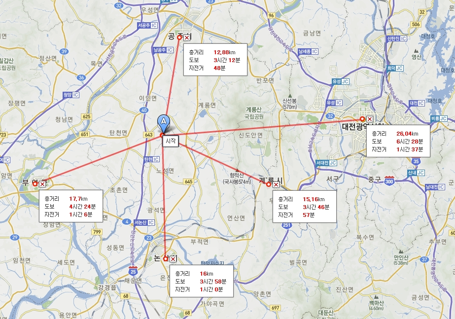

# 호남고속철도와 오송역

호남고속철도는 1987년 노태우 전 대통령(당시 대통령 후보)가 공약으로 내건 사항 중 하나로 당선과 동시에 추진되기 시작하였다. 그런데 이 노선 건설에는 우리나라 철도 역사상 최악의 어두운 그림자가 있다. 바로 오송역이다. 후술할 거의 모든 문제가 오송역으로부터 비롯되었다고 봐도 과언이 아닐 정도로 심각하다. 대체 무슨 일이 있었던 것일까? 그리고 다른 문제들로는 뭐가 있을까?

## 오송역 건설
경부고속선 건설 계획 원안에서는 조치원역 남쪽, 즉 현재의 세종특별자치시 시가지를 가로지르도록 건설할 예정이었고 오송역 경유는 아예 고려하지도 않았다. 그런데 청주지역 유지들이 경부고속전철 본선역 유치위원회를 결성하고 나서기 시작하면서 상황이 변하기 시작했다. 우선 1992년, 원래 노선상에 있는 터널 앞에서 깽판을 부려 노선을 오송역 쪽으로 휘게 만들었다. 그리고 이 깽판을 바탕으로 KTX 정차역을 지어 주겠다는 확약을 받아냈다.

| 이상록 당시 오송유치위 위원장의 인터뷰(2010. 10. 14) |
| -- |
| "건설교통부(현 국토해양부)에서 충북을 배제한채 조치원 서쪽 4-5㎞쯤에 위치한 금남으로 돌아가는 안을 주장했다. 추진위에서 건교부에 수차례 항의했으나 요지부동이었다. 이때문에 나와 박종원(전 한국병원이사장·작고)부위원장이 오송분기역으로 하지 않으면 부강-신탄진과 부강-내판간 협곡에 3톤트럭으로 폭탄을 실어 폭파시키겠다며 공공시설물이 파괴되지 않도록 재고하라고 서면으로 요구했다. 감옥에 갈 각오로 했는데 지금 생각하면 참 무모했지만 당시엔 다른 방법이 없었다." |

## 행정도시
행정수도 입지를 선정할 당시 유력한 후보로 거론되던 곳은 청원 오송, 공주 장기(현위치), 공주 계룡, 천안아산 정도였고 이 중에서 서울에서의 거리와 교통여건을 고려할 때 가장 입지가 탄탄하다고 평가받는 곳이 바로 오송이었다. 이 때만 해도 행정수도가 오송에 들어선다는 전제 하에 오송분기에 대한 여론이 제법 호의적이었다. 하지만 청주 지역 유지들이 오송 땅값을 너무 올려놓은 바람에 행정수도 최종 입지 선정에서는 아예 오송을 배제해버리는 사태가 벌어졌고 결국 고속철도와 한참 떨어진 현 위치를 택할 수밖에 없었다.

오송역만 아니었다면 현 세종행정도시 지역은 "고속선 통과+그럭저럭 넓은 부지+그럭저럭 견딜만한 지가" 라는 훌륭한 입지를 보유할 수 있었다. 설령 현 행정도시 부지가 오송처럼 땅값이 폭등했다 하더라도 오송지역에 행정도시를 건설하고 조치원역을 활용하면 현재의 세종시보다는 교통이 훨씬 원활했을 것이다.

## 호남고속철도 오송분기
호남고속철도 분기역으로는 원래 천안아산역 분기 또는 대전 분기가 유력하게 검토되고 있었다. 우선 천안아산역 쪽은 주 수요처인 수도권과 호남권 간을 최단거리로 연결한다는 장점이 있다. 호남권이 버스교통 초강세 지역이 된 건 철도 인프라가 상대적으로 떨어지는 것도 있지만 논산천안고속도로 덕에 소요시간이 크게 단축된 것도 무시할 수 없다. 대전역 쪽은 노선이 휘긴 하지만 경부선 부설 이후 100여년간 호남-영남 루트의 분기점 역할을 해 온 충청권 최대의 도시인 대전광역시의 막대한 수요를 잡을 수 있다.

그러나 오송역은 여객 취급도 중단된 충북선상의 간이역이라 수요가 있을 턱이 없었고, 노선은 노선대로 휘어 버리는 결과가 나오기 때문에 다른 두 역과 비교했을 때 내세울 게 전혀 없는 역이었다. 오송유치위와 청주를 사랑하는 모임(청사모) 측은 소위 X축 논리라는 것을 주장하였는데, 대략 ↘ 방향의 경부선과 ↙방향의 전라도-강원도를 잇는 고속철도가 X축을 이루고 중앙에 오송역이 있어야 한다는 논리다. 서울-강원도 노선은 그냥 쭉 이어버리는 것이 몇 배는 나으니 이 주장의 핵심 의의는 전라도-강원도를 연결하는 직행노선일 것이다.

그러나 문제는 수요이다. 광주 - 춘천간 고속버스 노선을 보면 하루 총 배차량이 4대이며 배차간격은 약 4시간 정도이다. 양쪽 지방에서 핵심적 도시라는 두 도시의 이동량이 이 모양이다. 철도는 더 심한데, ↙축을 담당했었던 광주-강릉 주말 임시열차는 이 역이 개통하기 3년 전인 2007년에 역사의 뒤안길로 사라졌다. 그리고 결정적으로 저들이 주장하는 X축은 어디까지나 남한에 한정된 X축일 뿐이다.

그런데 노무현 정권 때 수도이전 계획이 엎어지면서 분위기가 오송역 측에 유리하게 돌아가기 시작했다. 한나라당 쪽에서는 충청도 표심을 잡기에 바빴고, 열린우리당 측은 이를 묵인하는 상황이 벌어진 것. 오송 측은 정치권에 공작을 펼치는 등 사방팔방으로 미쳐 날뛰고 다녔다. 결국 오송역이 분기역으로 선정됨으로서 지역 유지들의 핌피질이 이어이 국가 간선철도를 망치고 말았다. 우선 대전 수요를 잃어버렸고, 공주와 세종시 수요까지 완전히 날려버렸다. 게다가 일부 KTX 열차의 서대전역 정차 여부를 두고 지역 간 갈등이 심화되는 결과를 낳았다. 그것으로도 모자라 선형이 뒤틀려 소요시간이 증가하였고 이는 곧 호남고속철도 자체의 경쟁력 약화로 이어졌다.

## 공주역
주변 지자체인 계룡시, 공주시, 부여군, 논산시, 대전광역시를 모두 만족시키기 위해 중간지점에 역을 선정하였다.

하지만 위의 그림에서 알 수 있듯이 공주역 주변엔 진짜 아무것도 없다. 유령역이 될 것이 불 보듯 뻔하다.

## 불필요한 중복투자
사실 호남선은 논산~서대전 구간만 제외하면 선형이 나쁘지 않은 편이며, 복복선으로 확장해야 할 정도의 수요가 있지는 않은 노선이다. 그런데 선형개량으로도 충분할 소요시간 문제를 가지고 지역균형발전 논리를 너무 무리하게 적용시켜  건설비는 건설비대로 버리고, 환경은 환경대로 파괴하며, 효율은 효율대로 저하되는 결과를 초래하였다.

## 개선 방안
억지로 몇 가지 말하자면
1. 오송읍 세종시 편입
2. 대전1호선 연장
3. 

